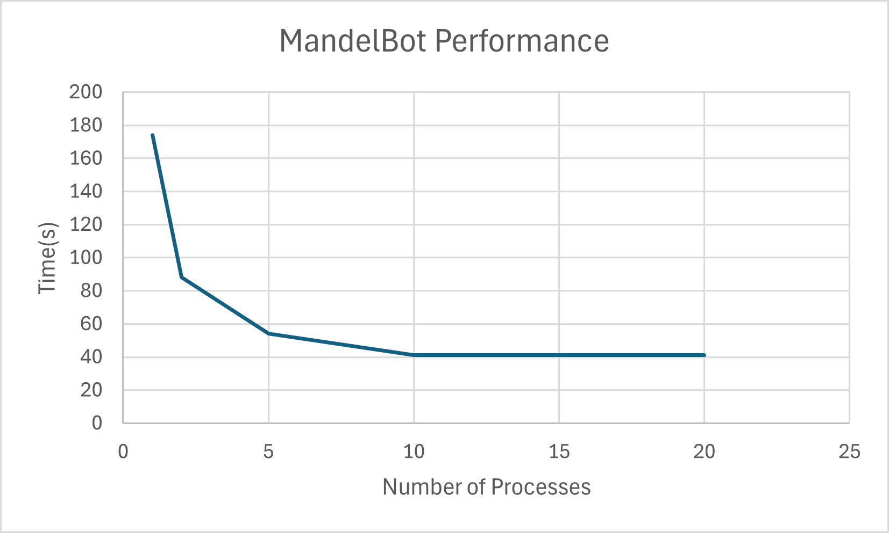

# System Programming Lab 11 Multiprocessing

This project generates Mandelbot fractal images using multiple processes and then combines the frames into a movie.

It consists of two main programs:

    ~ mandel – renders a single Mandelbot image to a JPEG.
    ~ mandelmovie – coordinates multiple child processes to generate many frames concurrently.

Timing Chart:

Number of Processes   | Time
1                     | 2m 54s
2                     | 1m 28s
5                     | 54s
10                    | 41s
20                    | 41s

## Performance Scaling

As expected, increasing processes significantly improves performance up until around
10 processes, after which diminishing returns occur because the system becomes CPU-bound.